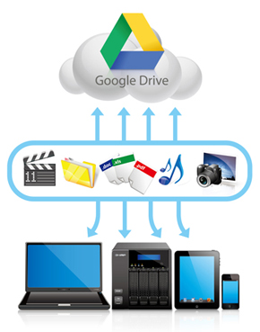

# Documentos colectivos con Google Docs

Mediante markdown y pandoc hemos visto maneras de compartir y editar documentos de texto. En algunas ocasiones puede ser útil compartir o editar de manera colectiva otro tipo de documentos como hojas de cálculo o formularios. Entornos como Google Docs y el disco virtual Google Drive amplian el formato de documentos que se pueden compartir o editar en grupo. 

Google Docs trabaja con un entorno gráfico algo que, aunque puede parecer una ventaja no lo es tanto. Google suele cambiar muy a menudo los interfaces, los lugares en los que están los botones, las opciones avanzadas, etc. Con un editor de comandos los inicios son más asperos, pero siempre tienes el control de lo que haces, no ocurre lo mismo con las interfaces gráficas.

## [El entorno Google](http://es.wikipedia.org/wiki/Google_Apps)

Google provee de un conjunto de aplicaciones y entornos, teóricamente gratuitos (se paga en pérdida de privacidad), que posibilitan el trabajo en grupo. Además de Google hay otros entornos pero en lo básico coinciden. Se trata de editores de texto con interface donde lo más importante son las opciones para compartir documentos o publicarlos en red.

Para un trabajo colaborativo puede ser interesante explorar los siguientes entornos/aplicaciones de Google: 

### [Google Drive](https://drive.google.com/)

Un "disco duro" en la nube (los documentos se guardan en internet) que permite acceder a estos desde cualquier dispositivo electrónico y crear copias de seguridad instantáneas de nuestros archivos. Dispone de una aplicación que se encarga de sincronizar en tiempo real los archivos y sus cambios desde nuestro disco duro, de manera que es posible tener la carpeta fisicamente en uno o varios dispositivos, y una copia en la nube. 

### [Google Docs](https://docs.google.com/)

Es un entorno asociado a Google Drive orientado a la crear, modificar o compartir documentos. Trabaja con documentos de texto, hojas de cálculo y presentaciones. 

Aunque no importa ni exporta en formatos .md o .tex, permite trabajar con documentos de word, libre office u open office, lo cual resulta útil en entornos en que las personas que colaboran tienden a trabajar con distintos sistemas operativos y programas. 

Del mismo modo los documentos creados se pueden exportar y retomar en otros programas. 

Cuando se intentan subir documentos .md a Google Docs este te sugiere aplicaciones en web para editarlos. Parece que existe un **Drive Notepad** que permite trabajar con formatos Markdown de manera colectiva, pero los documentos no se guardan en Google Docs, aunque probablemente si en Google Drive. 

[https://drivenotepad.appspot.com/]()

Y también **StackEdit**

[https://stackedit.io]()

### [Formularios Google](http://www.google.es/intl/es/forms/about/)

Permite crear formularios para compartir en red que pueden constar de espacios para rellenar información o respuestas a consultas. 

Es una opción interesante pues permite recopilar información, hacer encuestas de opinión y obtener resultados.  

### [Google Calendar](https://www.google.com/calendar/)

En este caso no se trata de documentos pero puede ser interesante para el trabajo en grupo disponer de distintos calendarios que pueden sincronizarse con aplicaciones tipo agenda en móviles, tabletas u ordenadores personales. Esto puede suponer tener al día el calendario de actividades, reuniones, conciertos, audiciones, claustros, etc, en un solo lugar y poder filtrar por capas los eventos. 

### Otras aplicaciones Google

#### Blogger

Permite crear y gestionar blogs en el que pueden contribuir varias personas. Más que para un trabajo colaborativo puede ser interesante para presentar información a los alumnos o a personas externas al centro sobre la música, instrumentos, o actividades del conservatorio. 

Es cierto que ya hay una estupenda página del Conservatorio que ofrece todo esto. Pero una idea que podría desarrollarse es disponer de algún tipo de blog con información sobre los diferentes departamentos, información sobre el instrumento, obras del repertorio, repertorio orientativo pruebas de acceso, etc. 

#### Google Maps /Earth

No parece a primera vista interesante para el trabajo docente en un conservatorio de música, pero puede ser útil para ciertos trabajos con alumnos sobre aspectos históricos del instrumento, de compositores, de intérpretes, etc. De esta manera se pueden visitar virtualmente lugares. 

Otro uso puntual pero quizás interesante es ubicar lugares en los que se hacen actividades externas al centro, de manera que los profesores que acudan o colaboren puedan localizarlo rápidamente. (Sí, para eso ya están los GPS, pero es una opción.)

#### Google Groups

Hace tiempo los usé, actualmente debería ponerme un poco al día. Pero pueden ser interesantes para compartir documentos con un grupo en vez de hacerlo con usuarios individuales. Además ofrece herramientas tipo foros. 
