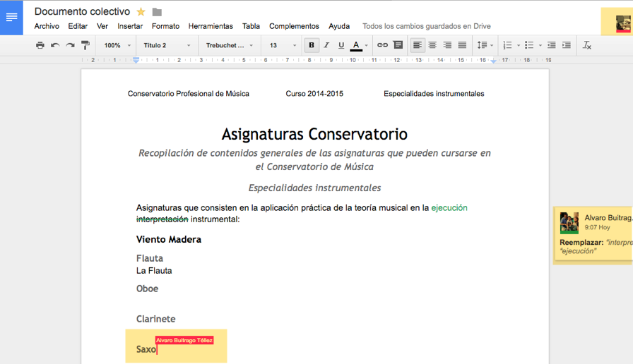

# Abrir y gestionar documentos en Google Docs: Control de versiones

* Para probar las propuestas de este apartado utilizaremos dos versiones de un documento (en este caso hoja de cálculo) la primera solo para comentar y la segunda para editar. Sobre ellas realizar algún comentario y, en su caso, cambios para visualizar el control de versiones y descargar al ordenador para abrir en algún otro programa.* 

[Hoja de cálculo para comentar](https://docs.google.com/spreadsheets/d/1NCnG7AjR5SweBAFyS7bbyhPrwagMUt8YsraU2_QyWWw/edit?usp=sharing)

[Hoja de cálculo para hacer alguna modificación](https://docs.google.com/spreadsheets/d/1myNrhqM5VoPAk_zzz9oLC6x6ogiG4A5NiVA3KhkwZWQ/edit?usp=sharing)

En **Archivo>Ver historial de revisiones** se pueden visualizar los cambios anteriores y los que estáis haciendo actualmente en el archivo. (observa que los cambios entre revisiones se resaltan en color según la persona que los ha hecho)

Aunque la apariencia de Google Docs sea la de un editor visual, el funcionamiento en la gestión interna tiene mucho que ver con los niveles de privacidad/visualización. Así tendremos documentos asociados a nuestra cuenta que serán propios o compartidos.

Como vemos Docs divide en varias categorías los archivos a los que podemos acceder: 

1. **Mi unidad** muestra archivos y carpetas en nuestra cuenta de Google Drive
2. **Compartido conmigo** muestra archivos y carpetas que otros usuarios han compartido con nuestra cuenta
3. **Destacados** muestra aquellas carpetas o documentos en las que hemos activido la opción Destacado en la cuenta de Google Drive (Probablemente en Google Drive tengamos una gran cantidad de archivos lo que hace dificil navegar a aquellos que son más importantes o con los que estamos trabajando. Destacar un elemento nos permite elevarle en importancia y acceder más rápidamente a él)
4. **Todos los elementos** muestra todos los archivos de Google Drive que son editables en Docs, de manera que oculta todo aquello que no lo es. 
5. **Subir** nos permite gestionar archivos de otros archivos o carpetas del disco duro para gestionar con Google Docs. Por ejemplo, los archivos de Office son editables en Docs, así que podemos importarlos y trabajar con ellos de manera colectiva en este espacio (Onedrive de Microsoft funciona de manera similar pero viculado a una cuenta hotmail, msn o educa.jcyl)

## Chrome y Docs. Trabajar fuera de línea

El navegador [Google Chrome](https://www.google.es/chrome/browser/desktop/index.html) permite instalar [extensiones o aplicaciones](https://chrome.google.com/webstore/category/extensions?hl=es&_feature=offline) que ayudan a gestionar más rápidamente las aplicaciones Google. Las aplicaciones añaden capacidades al navegador, entre otras poder trabajar fuera de línea con Docs. 

Existen extensiones para otros navegadores que también pueden permitirnos trabajar fuera de línea. 

## Control de cambios

Un aspecto importante cuando se trabaja en edición colectiva y con documentos compartidos es tener un control de versiones y cambios, de manera que podamos recuperar una versión del documento si no estamos de acuerdo con cambios propuestos o ejecutados por otras personas. 

Para ver el listado de versiones del documento tenemos que ir a **Archivo>Ver historial de revisión** y nos mostrará un listado de las sesiones en las que se ha trabajado con el documento y los cambios que se han realizado, pudiendo recuperar cualquiera de ellas pulsando sobre una y elegiendo la opción **Restaurar esta revisión**. Si además pulsamos el botón **Mostrar revisiones más detalladas** nos mostrará con más precisión el listado de cambios. 

Si se trata de un documento importante lo mejor es compartirle con la opcion **Permitir comentarios** así el resto de personas que contribuyen solo pueden proponer cambios o criticar el documento, pero no modificarle. 

## ¿Qué ocurre si dos o más usuarios editan el mismo documento a la vez?

Cuando varios usuarios están viendo o editando el mismo documento Google Docs nos avisa con dos señales. En la parte superior de la pantalla vemos un cuadradito con la imágen de los otros usuarios y una raya rojo que nos avisa, y en el documento vemos un cursor rojo con la posición en la que está el cursor del otro usuario. En la captura de imagen soy yo mismo con dos cuentas en dos navegadores haciendo dos tipos de cambios. 

El problema es que si ambos tienen opción de modificar el documento se pueden estar pisando los cambios una y otra vez. Si el documento está en opción de comentar las propuestas aparecerán como sugerencias que el propietario del documento podrá aceptar o no. Aunque luego se puede recuperar la versión en el historial, puede ser una extrategia de trabajo poco recomendable.

## Modos de edición o visualización de un documento

Cuando editamos un documento en Docs tenemos en la esquina superior derecha un icono que nos permite elegir el modo en el que gestionar el documento: 

- **Edición** nos permite hacer cambios sin más. 
- **Sugerencias** hace que los cambios sean solo comentarios que luego pueden aceptarse. Recomendable para un trabajo en grupo que no provoque problemas. Así un coordinador puede finalmente aceptar o no las sugerencias sin convertirse en un continuo reparche de cambios y recambios. 
- **Visualización** modo de solo lectura

## Exportar documentos de Google Docs

El formato de Docs no es directamente compatible con documentos tipo de otros editores de texto, hojas de cálculo o imágenes. Para ello tenemos la opción **Archivo>Descargar como** que nos ofrece varias opciones de formato, desde PDF a docx, txt o html. Opciones interesantes para obtener una versión del documento que luego gestionar con pandoc u obtener una versión md.

Propuesta de actividades

1. Observa el comportamiento de los documentos enlazados y realiza comentarios y modificaciones. 
2. Crea un documento sencillo, haz varias modificaciones y versiones. Restaura una versión anterior. 
