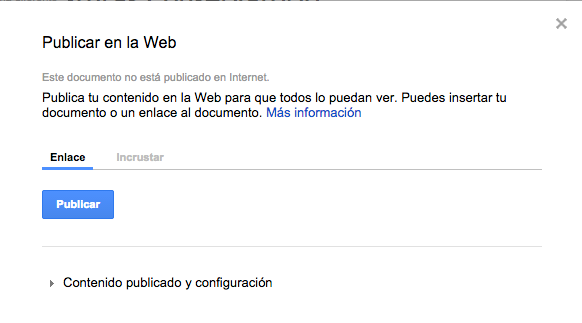
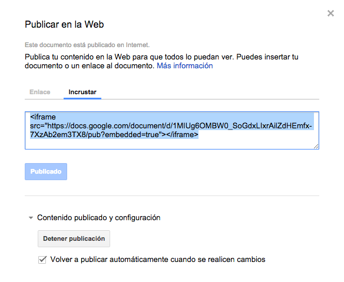

# Incrustar (publicar en la web) un documento Google Docs

En la actividad anterior exploramos las opciones de privacidad (más bien de visibilidad) de los documentos de Google. Compartir mediante enlaces puede ser un tanto tedioso y simplifica el trabajo publicar el documento en una web o un foro que después los destinatarios de la información visitan. Allí leen el documento. 

Por ejemplo podemos compartir un documento destinado a su lectura por otros profesores (un borrador de programación, un programa de audición, el menú de la cena fin de curso, etc.) o para los alumnos (unos apuntes, la lista de actividades, un calendario de audiciones/exámenes,...) en una entrada del Campus Virtual y que quienes lean la entrada del blog lean allí el documento, puedan comentarlo o modificarlo según las opciones de privacidad establecidas. Esto nos permite además que podamos modificar el documento y los cambios se actualicen en la web, foro o blog en el que está publicado. 

## Primer paso: Publicar en la Web

Además de los permisos ya establecidos, Google solicita una segunda confirmación de que queremos que el documento sea visible al publicarse en una web. 

Tanto para esto como para obtener el código que nos permita incrustarlo tenemos que ir al menú **Archivo>Publicar en la Web** 

Primero tendremos que pulsar en el botón **Publicar**. Si más tarde decidimos no mantener la publicación de este documento en páginas web o blogs solo hay que pulsar en **Detener publicación** Por defecto aparece activada la opción **Volver a publicar automáticamente cuando se realicen cambios** Esto quiere decir que cada cambio posterior al documento aparecerá en la versión web. Si queremos mantener la versión antigua del documento como publicada debemos desactivar esto y volver a publicarlo manualmente cuando lo deseemos o cuando consideremos acabados los cambios.

## Segundo paso: Obtener el código

Una vez publicado en Web seleccionamos la opción **Incrustar** que nos mostrará el código HTML a copiar y pegar en el editor de código de la página, foro o blog. (Si lo pegamos en el editor visual lo mostrará como texto y no ejecutará el código)

### Chapuza de Google con el tamaño

Nadie sabe muy bien la razón, pero el código que genera Google no permite determinar el tamaño del marco en el que se incrusta el documento. Así que tendremos que <u>añadirlo manualmente antes del final</u>  en el código generado insertando las palabras **width="nº"**  (ancho) y **height=" nº"** (largo), por ejemplo: 

	=true" width="800" height="1200"></iframe>

Si no añadimos esto en el código el documento se mostrará en una ventana minúscula que hará casi imposible su lectura.

## Actividades sugeridas

1. Publica uno o varios documentos sencillos creados con Google Docs y cambia las opciones de privacidad/visibilidad
2. Obtén el código HTML de uno de esos documento y publícalo en el foro del grupo de trabajo. 
