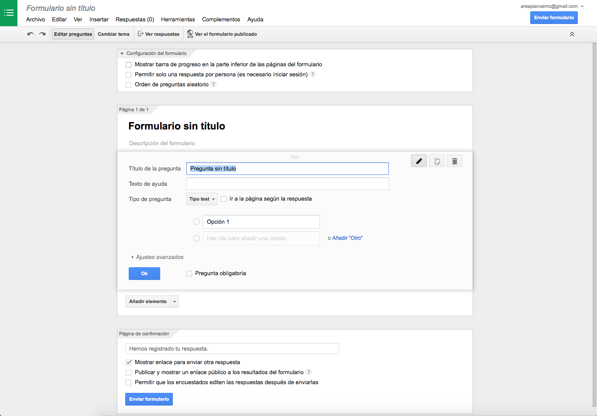
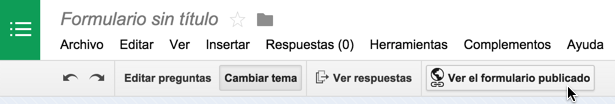

# Formularios Google

Un [formulario Google](https://support.google.com/docs/answer/87809?hl=es) permite la entrada de información o la recopilación de datos a través de un documento publicado en internet.  El resultado puede vincularse a una hoja de cálculo para obtener una vista de las respuestas o crear el formulario desde una hoja de cálculo. 

## Cómo crear un formulario

En la página principal de Google Docs elegimos la opción **Formularios** y accedemos. Se creará un formulario sin título que podremos personalizar y se guardará en Google Docs.

En la parte superior de la pantalla podemos personalizar el nombre para el formulario. Debajo tenemos una cara de menú con la que utilizar las opciones del editor. 

Una vez establecido el nombre tenemos unas casillas en las que configurar el formulario

### Opciones de un formulario

- Mostrar la *barra de progreso*
- Permitir *una sola respuesta por persona* (solo podrán contestar quienes inicien sesión en Google)
- Orden de *preguntas aleatorio* (cada vez que se abre el formulario para contestar las respuestas se cambian de orden)

Debajo accedemos al editor de ítems del formulario. Existen varios elementos, desde casillas de texto corto o texto párrafo a preguntas tipo test, 

### Elementos en un formulario

Google divide los elementos de un formulario en Básicos, Avanzados y de Diseño. 

Los *básicos* responden a el formato de recogida de datos más habitual en un formulario. 

Los *avanzados* a formatos relacionados con lo numérico.

En *diseño* tenemos opciones para dar formato en secciones al formulario, establecer saltos de página o insertar elementos multimedia. 

### Confirmación de respuesta

En este bloque se puede personalizar el comportamiento del formulario al ser completado. Puede mostrar una mensaje personalizado, mostrar un enlace público a las respuestas o permitir que las respuestas puedan ser editadas para cambios de opinión o datos. 

## Enviar el formulario

Es la opción equivalente a Guardar. El formulario se guarda en nuestros documentos Google Drive y en nuestra carpeta local si lo tenemos configurado así. En nuestro disco duro aparecerá con la extensión *.gform* y la hoja de cálculo asociada a las respuestas como *.gsheet*. Lamentablemente son formatos de documento que solo se pueden editar con aplicaciones Google. 

## Ver el formulario publicado

Pulsado el botón obtenemos la vista del formulario que hemos editado en la forma en que se mostrará a las personas con las que lo compartimos.

## Seguimiento de los resultados

Hay dos formas de leer las respuestas. Una de ellas, la más incómoda de consultar, pero útil para reutilizar los resultados, se obtiene a través del botón **Ver respuestas** en forma de hoja de cálculo. 

Más claro y colorido es observarlo en el menú **Respuestas>Resumen de respuestas** que muestra en forma de gráficos de sector, diagramas de barras o listas de respuesta los resultados de las aportaciones al formulario. 

## Utilidades de los formularios en un contexto educativo

Podríamos clasificar en dos grupos las posibilidades de utilizar un formulario como herramienta de colaboración en línea en un centro educativo. 

- **Preguntas y formularios de contenido administrativo o de coordinación pedagógica**. Desde el centro se habilitan formularios en los que recopilar opiniones o información. Por ejemplo, someter a votación unas posibles fechas para un acto académico, conocer opiniones sobre usos del centro, opinión sobre materiales a adquirir o simplemente propuestas de temas a tratar en claustro. 

	[->Ejemplo de formulario de opinión](http://goo.gl/forms/84j2s2NQyd)

	También podrían entrar en esta categoría formularios de opinión para padres y alumnos sobre el funcionamiento del centro, horarios, sugerencias, etc. 

- **Formularios para uso didáctico**. A través de un formulario publicado en red, se puede valorar el conocimiento de los alumnos sobre un tema, o hacer propuestas didácticas. Los formularios no permiten una evaluación individual de las respuestas (para eso hay otras herramientas como Hotpotatoes) pero pueden ser una forma de proponer actividades. 

	[->Ejemplo 1 de formulario de uso didáctico](http://goo.gl/forms/6LAq3ALQ50)
	
	Publicación en un blog [Pulsa aquí para acceder](https://alvarobuitrago.wordpress.com/2015/03/08/ejemplo-de-publicacion-de-un-formulario-google/)

	[->Ejemplo2 de formulario de uso didáctico](http://goo.gl/forms/a9pE0tGIQe)

	Por ejemplo, un formulario que incluya un vídeo de una interpretación de una obra y una serie de preguntas sobre la misma: reconocer el autor, el estilo, comentar aspectos técnicos. Del mismo modo una audición comparada o una "búsqueda del tesoro", presentar en formato de imagen una partitura o un autor o un intérprete y que los alumnos tengan que investigar qué o quién es y aportar algún dato. A través de esa investigación los alumnos dedican algo de tiempo a escuchar música y a ampliar sus conocimientos.

En estos casos lo más importante no es la exactitud de las respuestas sino el estimular la curiosidad, la audición musical y el debate sobre la música de modo que no se reduzca a una escucha individual en casa. 

## Incrustar un formulario

Una vez creado el formulario mediante el botón **Enviar formulario** podemos hacérselo llegar a direcciones de correo o grupos. 

Otra opción es incrustarlo en una página web o un blog de manera que quienes accedan puedan responder allí mismo a las preguntas. 

Para generar el código HTML que permite incrustar el formulario en una página web o un blog **Enviar formulario>Incrustar** nos genera el código que copiar y pegar en el editor HTML del blog o la página web. 

	<iframe src="https://docs.google.com/forms/d/16Z6N-7AnRmr8JHx3Vb07gJ_fisyR_PLlvdijdIBQjes/viewform?embedded=true" width="760" height="500" frameborder="0" marginheight="0" marginwidth="0">Cargando...</iframe>

## Propuesta de actividades

