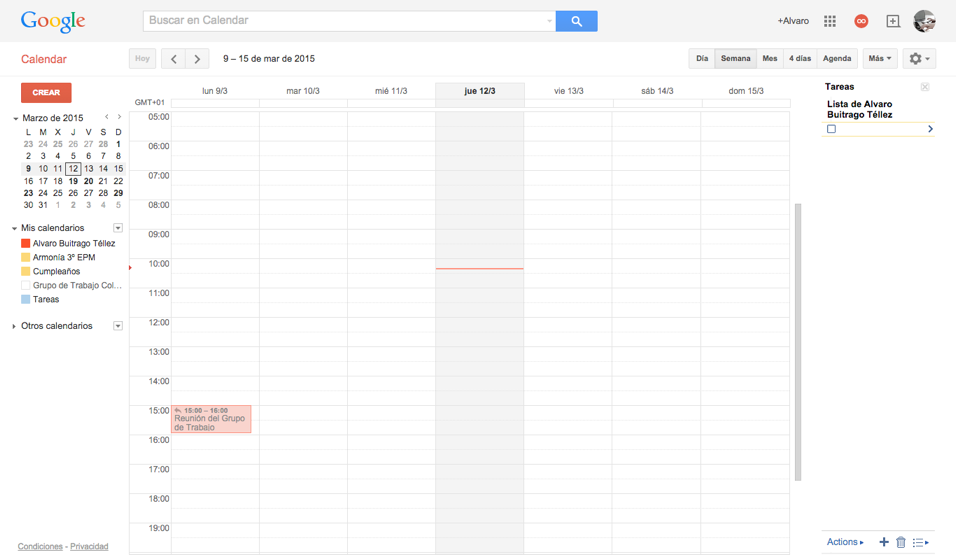
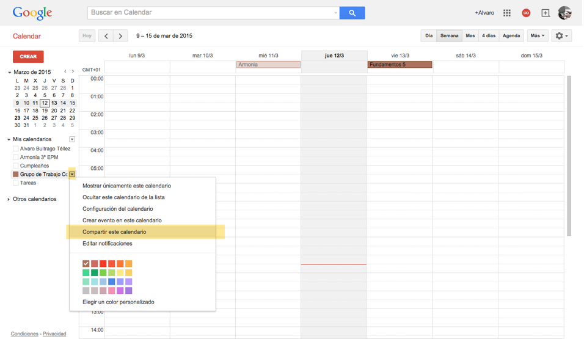
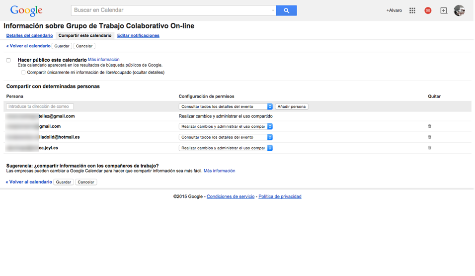
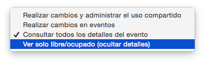
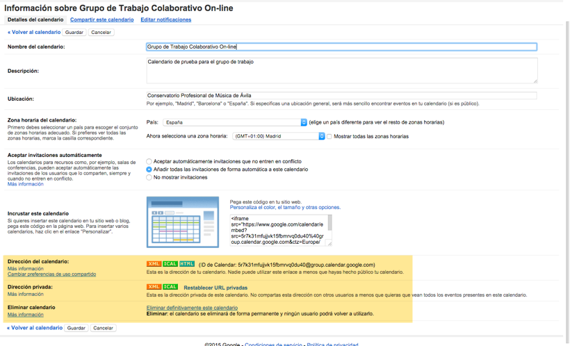
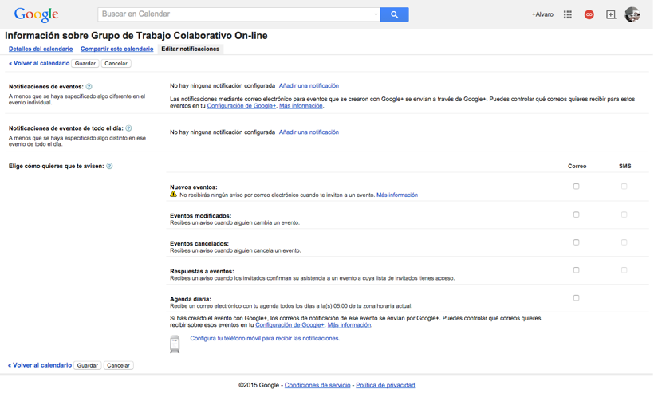

# Gestión de Calendarios Google

[>Calendario compartido del Grupo de trabajo](https://www.google.com/calendar/embed?src=5r7k31mfujjvk15fbmrvq0du40%40group.calendar.google.com&ctz=Europe/Madrid)

Tener un calendario común en el que añadir eventos tipo reuniones, plazos de entrega, actos, etc, es siempre importante en el trabajo en grupo. De nuevo hay muchas opciones para compartir calendarios y de nuevo Google facilita una opción gratuita y eficaz que permite un uso conjunto en cualquier sistema operativo.

[> Ir a Google Calendar](https://www.google.com/calendar?hl=es)

En la parte derecha de la ventana de Calendarios tenemos un listado desplegable con **Mis calendarioa** Allí podemos gestionar los calendarios, visualización de todos o solo alguno, los colores, las notificaciones, etc. 

## Opciones de privadidad del calendario

Al igual que en los documentos, pero en este caso más, es importante tener en cuenta los niveles de privacidad o visibilidad del calendario. En la flecha de la pestaña del calendario en cuestión desplegamos las opciones y elegimos **Compartir este calendario**

No se recomienda la opción **Hacer público este calendario** si van a aparecer eventos personales o datos que puedan dar información que se pueda usar en nuestro perjuicio. Por ejemplo, mantener un calendario público que pueda dar pistas sobre cuándo vamos o no a estar en casa. Como opción intermedia nos permite publicar solo la información **libre/ocupado** sin detalles de qué actividad tenemos anotada en el calendario. 

Dependerá del uso del calendario la posibilidad de hacerlo más o menos público. Por ejemplo un calendario con las actividades del centro (audiciones, fechas de matriculación, puertas abiertas, audiciones, etc) podrá ser público. Pero no se recomendaría la misma visibilidad para actividades internas tipo departamentos.

Dicho esto en este caso Google solo nos da la opción de ir introduciendo uno por uno los correos electrónicos de las personas con las que compartir un calendario. *(PENDIENTE) comprobar si se pueden compartir con todas las personas de un grupo de Google Groups para facilitar la gestión sin tener que ir persona por persona.* Esto no es muy trabajoso en el caso de un departamento que tampoco tiene muchos miembros, pero sí podría serlo para gestionar calendarios para alumnos o de todo el centro, incluidos padres. 

En cada caso podemos configurar el nivel de acceso de las personas que ven el calendario: desde **Realizar cambios y administrar** a solo **Ver solo libre/ocupado(ocultar detalles)**

## Detalles del calendario: Incrustar, compartir, exportar

Más intuitivas son las opciones del panel **Detalles del calendario**

En el apartado **Incrustar calendario** podemos obtener el código para incrustarlo en una web o un blog. No servirá de nada si no hemos hecho público el caledario. Aquí ni siquiera quien tenga el enlace podrá ver el calendario. 

En **Dirección del calendadario** podemos descargar el calendario en diferentes formatos para compartirlo con otras aplicaciones de calendario. Tampoco será útil si no es calendario compartido. 

En **Dirección privada** sí podemos obtener una copia para descargar o compartir aunque no lo tengamos publicado. De nuevo manejar con cuidado si el calendario tiene información privada que no debería estar al alcance de otras personas. 

## Notificaciones del calendario

Al igual que en otras aplicaciones de este tipo podemos gestionar qué tipo de avisos queremos recibir para los eventos marcados en el calendario. 

