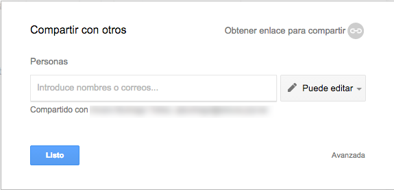
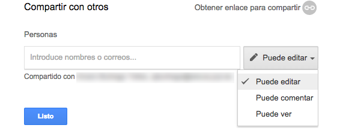
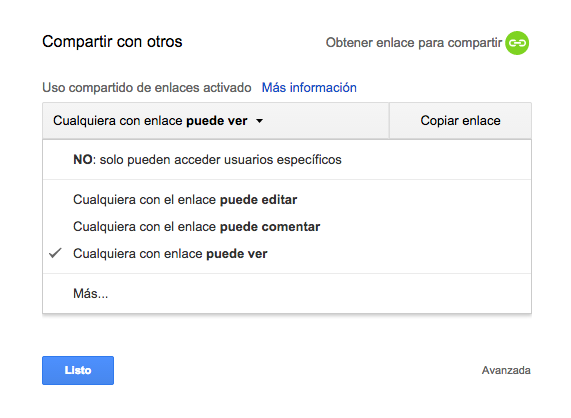
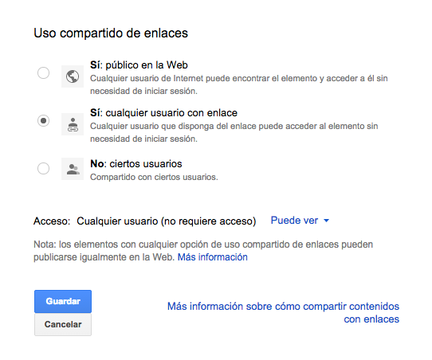
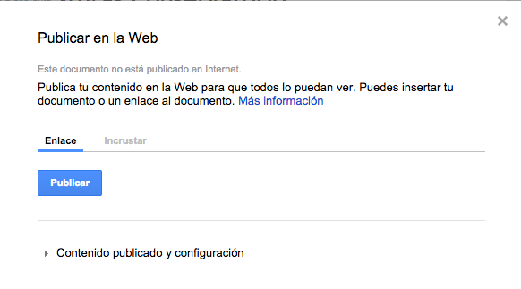

# Documentos de texto u hojas de cálculo

El funcionamiento del editor de texto de Google Docs es muy parecido al de otros editores de texto WYSIWYG (Lo que ves es lo que obtienes), así que no parece necesario entrar en detalles sobre la edición en particular. En caso de dudas se pueden tratar en el foro del grupo de trabajo. 

La utilidad que puede tener Google Docs para un trabajo en grupo está en las opciones para compartir y editar de manera colectiva documentos. Para ello hay que conocer la manera de modificar las opciones de visibilidad de un documento publicado mediante este entorno. 

# Compartir

Es la clave de la publicación de documentos o su puesta en manos de un grupo. Se puede acceder a través de **Archivo** o en el botón destacado en la parte superior derecha (Google cambia a menudo la disposición de estos elementos) **Compartir**

## Compartir de manera directa

En el primer panel emergente tenemos las opciones generales para compartir

En la casilla en blanco podemos añadir uno por uno direcciones de correo a las que enviar el enlace al documento y en la lista desplegable de la izquierda decidir qué pueden hacer con el documento que reciben. 

Por menor restricción en el uso tenemos las opciones: 

- *Puede editar* Permite a quien reciba el enlace obtener control de él y modificarlo. Google Docs lleva un control de cambios para gestionar versiones. 
- *Puede comentar* Quien recibe el enlace puede leer el documento y hacer comentarios en el mismo que el propietario recibe. Pero no puede modificar nada del archivo. Es una manera de recibir sugerencias en un documento sin que haya varios editores del mismo. 
- *Puede ver* Es la opción más restrictiva de todas. Quien recibe el enlace solo puede ver el documento, leerlo, pero no hacer ni comentarios, ni modificarlo. 

## Compartir mediante enlace

En la esquina superior derecha del mismo panel tenemos la opción de obtener el enlace para compartir sin enviarlo por correo electrónico. Copiando y pegando el enlace podemos compartirlo en una web o en un documento sin tener que ir añadiendo correos uno por uno. 

También tenemos un desplegable para establecer del mismo modo las opciones de control de quien recibe el enlace sobre el documento. 

Es importante tener en cuenta las opciones de privacidad del documento pues si lo compartimos o publicamos y tenemos la opción **No: ciertos usuarios** el documento no estará visible para todo el que reciba el enlace si no lo incluimos en la relación de correos o si no ha iniciado sesión en Google. 

Podemos acceder a estas opciones en la esquina inferior izquierda del panel anterior pulsando en la palabra **Avanzada>Cambiar**

Ejemplo de documentos con diferentes opciones de privacidad: *(Son tres copias del mismo documento con diferentes opciones de privacidad)*

- **Puede ver**: Pulsado [este enlace](https://docs.google.com/document/d/1MIUg6OMBW0_SoGdxLIxrAilZdHEmfx-7XzAb2em3TX8/edit?usp=sharing)se debería poder acceder al documento en la opción *puede ver*
- **Puede comentar**: Pulsando [este enlace](https://docs.google.com/document/d/1F1G0XiM3jxvrbuVx8a_0FPVVPRTgFFD86jmVGr9hY78/edit?usp=sharing)
- **Puede editar**: Pulsado [este enlace](https://docs.google.com/document/d/1jNLbicT8B3_zOT0NyqK9Sgn5_SCBMNEROdpf4JH4AqU/edit?usp=sharing)

## Incrustar (publicar en la web) un documento Google

Una opción interesante de Google Docs es la posibilidad de incrustar (embeber o añadir como elemento visual) en una página web o un blog. Así los destinatarios de la lectura del documento no tendrán que acceder al enlace. Podemos publicarlo en un blog (por ejemplo en una entrada del Campus Virtual) y que quienes lean la entrada del blog lean allí el documento, puedan comentarlo o modificarlo según las opciones de privacidad establecidas. 

Para obtener el código HTML que incluir en nuestra página web o entrada del blog tenemos que ir al menú **Archivo>Publicar en la Web** 

IMPORTANTE: Primero tendremos que pulsar en el botón **Publicar** para dar permiso a que el documento aparezca en la web *(si más tarde decidimos no mantener la publicación de este documento en páginas web o blogs solo hay que pulsar en **Detener publicación**)* Después seleccionamos la opción **Incrustar** que nos mostrará el código HTML a copiar y pegar en la página.

Por defecto aparece activada la opción **Volver a publicar automáticamente cuando se realicen cambios** Esto quiere decir que cada cambio posterior al documento aparecerá en la versión web. Si queremos mantener la versión antigua del documento como publicada debemos desactivar esto y volver a publicarlo manualmente cuando lo deseemos o cuando consideremos acabados los cambios. 

### Chapuza de Google con el tamaño

Nadie sabe muy bien la razón, pero el código que genera Google no permite determinar el tamaño del marco en el que se incrusta el documento. Así que tendremos que <u>añadirlo manualmente antes del final</u>  en el código generado insertando las palabras **width="nº"**  (ancho) y **height=" nº"** (largo), por ejemplo: 

	=true" width="800" height="1200"></iframe>

 

